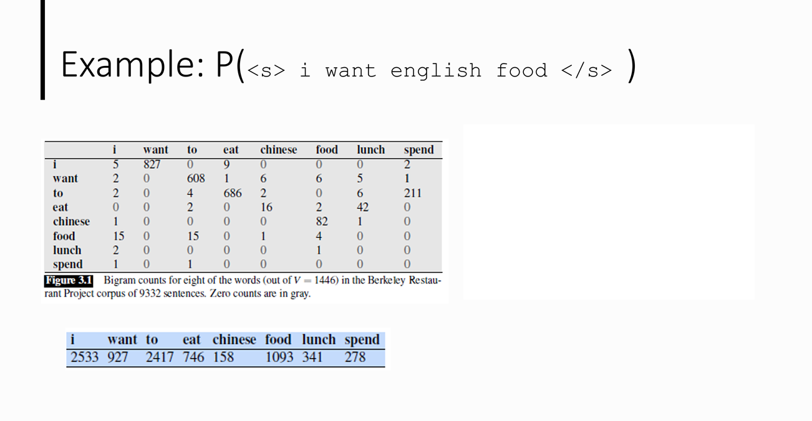

# Text Representation

**Traditional: focus on word occurrence and
_frequency without understanding meaning or
context_.**

Traditional Text Representation Methods:

1.  Bag of Words (BoW) model.
2.  Term Frequency-Inverse Document
    Frequency (TF-IDF).
3.  N-Grams

## 1. Bag of Words Representation

Bag-of-word: unordered set of words with their frequencies while position is ignored.

### ✅ **Advantages of BoW**

1. **Simple and Easy to Implement**
2. **Works Well for Small Datasets**

### ❌ **Limitations of BoW**

1. **Ignores Word Order and Context**
2. **Doesn’t Capture Semantic Meaning**

## **Example:**

**"I am a data scientist and I enjoy learning text data mining."**

### **Vocabulary**

The unique words in the sentence (ignoring case and punctuation):

| Word          | Count |
| ------------- | ----- |
| **I**         | 2     |
| **am**        | 1     |
| **a**         | 1     |
| **data**      | 2     |
| **scientist** | 1     |
| **and**       | 1     |
| **enjoy**     | 1     |
| **learning**  | 1     |
| **text**      | 1     |
| **mining**    | 1     |

## **2. Term Frequency – Inverse Document Frequency (TF-IDF)**

## **What is TF-IDF?**

TF-IDF is a technique used in **Natural Language Processing (NLP)** to measure the **importance of a word in a document** relative to a collection of documents (corpus).

### ✅ **Advantages of TF-IDF**

1. **Reduces Impact of Common Words**
2. **Simple and Easy to Implement**

### ❌ **Limitations of BoW**

1. **Ignores Word Order and Context**
2. **Doesn’t Capture Semantic Meaning**

### It consists of two parts:

1. **Term Frequency (TF)**: Measures how often a word appears in a document.

   $$
   TF(w) = \frac{\text{Number of times word } w \text{ appears in a document}}{\text{Total words in the document}}
   $$

2. **Inverse Document Frequency (IDF)**: Measures how important a word is across multiple documents.

$$
IDF(w) = \log \left( \frac{\text{Total number of documents}}{\text{Number of documents containing word } w} \right)
$$

**TF-IDF Score**:

$$
TF\text{-}IDF(w) = TF(w) \times IDF(w)
$$

---

## **Example**

### **Corpus (3 Documents)**

**Document 1**:  
_"I am a data scientist and I enjoy learning text data mining."_

**Document 2**:  
_"Data science is the process of using data to extract insights."_

**Document 3**:  
_"Machine learning is a key part of data science."_

---

### **Step 1: Term Frequency (TF)**

Let's compute **TF** for the word **"data"** in each document:

| Document  | **Total Words** | **Occurrences of "data"** | **TF(data)**   |
| --------- | --------------- | ------------------------- | -------------- |
| **Doc 1** | 10              | 2                         | 2/10 = **0.2** |
| **Doc 2** | 10              | 2                         | 2/10 = **0.2** |
| **Doc 3** | 9               | 1                         | 1/9 = **0.11** |

---

### **Step 2: Inverse Document Frequency (IDF)**

Since **"data"** appears in **all three documents**, the **IDF** is:

$$
IDF(data) = \log \left( \frac{3}{3} \right) = \log(1) = 0
$$

For another word, say **"scientist"**, appearing only in **Doc 1**:

$$
IDF(scientist) = \log \left( \frac{3}{1} \right) = \log(3) \approx 0.477
$$

---

### **Step 3: Compute TF-IDF**

TF-IDF for **"data"**:

$$
TF\text{-}IDF(data) = TF(data) \times IDF(data) = 0.2 \times 0 = 0
$$

TF-IDF for **"scientist"**:

$$
TF\text{-}IDF(scientist) = 0.1 \times 0.477 = 0.0477
$$

---

### **Interpretation**

- **"Data"** appears in every document, so **IDF = 0**, making its **TF-IDF score = 0** (not informative).
- **"Scientist"** appears only in **one document**, so it gets a higher **TF-IDF score**.

 

## 3. NGram Probability Calculation with Laplace Smoothing

### **1. Bigram Model with Markov Assumption**

Using the **Bigram Language Model**, the probability of a sentence is:

$$
P(W) = P(w_1 | < s>) P(w_2 | w_1) P(w_3 | w_2) \dots P(w_n | w_{n-1}) P( | w_n)
$$

Applying **Laplace Smoothing**, the bigram probability is:

$$
P(w_i | w_{i-1}) = \frac{C(w_{i-1}, w_i) + 1}{C(w_{i-1}) + V}
$$

where:

- $C(w*{i-1}, w_i)$ = Count of bigram $(w*{i-1}, w_i)$
- $C(w*{i-1})$ = Count of unigram $w*{i-1}$
- $V$ = Vocabulary size (**1446** from the table)
- **Laplace smoothing (Add 1)** ensures probabilities are nonzero.

---

### **2. Extract Required Counts**

For the sentence **`<s> i want english food `**, we need:

1. **P(i | < s>)**
2. **P(want | i)**
3. **P(english | want)** → **(Not in Table, Laplace smoothing applied)**
4. **P(food | english)** → **(Not in Table, Laplace smoothing applied)**
5. **P(\</s\> | food)**

From the table:

- $C(i) = 2533$
- $C(want) = 927$
- $C(food) = 1093$

---

### **3. Compute Bigram Probabilities with Laplace Smoothing**

#### **Step 1: Compute P(i | < s>)**

Since $C(< s>, i)$ is missing, assume **1** (unknown case):

$$
P(i | < s>) = \frac{C(< s>, i) + 1}{C(< s>) + V} = \frac{1 + 1}{2533 + 1446}
$$

$$
P(i | < s>) = \frac{2}{3979} \approx 0.0005
$$

---

#### **Step 2: Compute P(want | i)**

From the table: $C(i, want) = 827$

$$
P(want | i) = \frac{827 + 1}{2533 + 1446} = \frac{828}{3979} \approx 0.2081
$$

---

#### **Step 3: Compute P(english | want) (Unknown bigram)**

Since **"english"** is not in the table, apply **Laplace smoothing**:

$$
P(english | want) = \frac{0 + 1}{927 + 1446} = \frac{1}{2373} \approx 0.0004
$$

---

#### **Step 4: Compute P(food | english) (Unknown bigram)**

$$
P(food | english) = \frac{0 + 1}{1 + 1446} = \frac{1}{1447} \approx 0.0007
$$

---

#### **Step 5: Compute P(< /s> | food)**

Since **food → < /s>** is missing:

$$
P(\< /s> | food) = \frac{0 + 1}{1093 + 1446} = \frac{1}{2539} \approx 0.00039
$$

---

### **4. Compute Final Probability**

Multiply all probabilities:

$$
P(\text{sentence}) = P(i | < s>) \times P(want | i) \times P(english | want) \times P(food | english) \times P(\</s> | food)
$$

$$
= (0.0005) \times (0.2081) \times (0.0004) \times (0.0007) \times (0.00039)
$$

$$
= 0.0005 \times 0.2081 \times 0.0004 \times 0.0007 \times 0.00039
$$

$$
\approx 1.14 \times 10^{-11}
$$

---

### **Answer**

The **Bigram Probability** of the sentence **"`i want english food`"** using **Laplace Smoothing** is:

$$
P(\text{i want english food}) \approx 1.14 \times 10^{-11}
$$

> [!CAUTION]
> Numerical Underflow
> Use log probabilities as below

### **1. Bigram Model with Log Probabilities**

Using the **Bigram Language Model**, the probability of a sentence is:

$$
P(W) = P(w_1 | < s>) P(w_2 | w_1) P(w_3 | w_2) \dots P(w_n | w_{n-1}) P(< /s> | w_n)
$$

Applying **Laplace Smoothing**, the bigram probability is:

$$
P(w_i | w_{i-1}) = \frac{C(w_{i-1}, w_i) + 1}{C(w_{i-1}) + V}
$$

To prevent **underflow**, we take the **log transformation**:

$$
\log P(W) = \sum \log P(w_i | w_{i-1})
$$

where:

- **Log probabilities replace multiplication with addition**, making calculations **numerically stable**.

---

### **2. Extract Required Counts**

For the sentence **`<s> i want english food < /s>`**, we need:

1. **log P(i | < s>)**
2. **log P(want | i)**
3. **log P(english | want)** → **(Not in Table, handled with Laplace smoothing)**
4. **log P(food | english)** → **(Not in Table, handled with Laplace smoothing)**
5. **log P(< /s> | food)**

From the table:

- $C(i) = 2533$
- $C(want) = 927$
- $C(food) = 1093$
- Vocabulary size **$V = 1446$**

---

### **3. Compute Log Probabilities with Laplace Smoothing**

#### **Step 1: Compute log P(i | < s>)**

Since $C(< s>, i)$ is missing, assume **1** (unknown case):

$$
P(i | < s>) = \frac{C(< s>, i) + 1}{C(< s>) + V} = \frac{1 + 1}{2533 + 1446}
$$

$$
P(i | < s>) = \frac{2}{3979} \approx 0.0005
$$

Taking the **log**:

$$
\log P(i | < s>) = \log(0.0005) \approx -7.60
$$

---

#### **Step 2: Compute log P(want | i)**

From the table: $C(i, want) = 827$

$$
P(want | i) = \frac{827 + 1}{2533 + 1446} = \frac{828}{3979} \approx 0.2081
$$

Taking the **log**:

$$
\log P(want | i) = \log(0.2081) \approx -1.57
$$

---

#### **Step 3: Compute log P(english | want) (Unknown bigram)**

Since **"english"** is not in the table, apply **Laplace smoothing**:

$$
P(english | want) = \frac{0 + 1}{927 + 1446} = \frac{1}{2373} \approx 0.0004
$$

Taking the **log**:

$$
\log P(english | want) = \log(0.0004) \approx -7.82
$$

---

#### **Step 4: Compute log P(food | english) (Unknown bigram)**

$$
P(food | english) = \frac{0 + 1}{1 + 1446} = \frac{1}{1447} \approx 0.0007
$$

Taking the **log**:

$$
\log P(food | english) = \log(0.0007) \approx -7.26
$$

---

#### **Step 5: Compute log P(< /s> | food)**

Since **food → < /s>** is missing:

$$
P(< /s> | food) = \frac{0 + 1}{1093 + 1446} = \frac{1}{2539} \approx 0.00039
$$

Taking the **log**:

$$
\log P(< /s> | food) = \log(0.00039) \approx -7.85
$$

---

### **4. Compute Final Log Probability**

Now, summing all **log probabilities**:

$$
\log P(\text{sentence}) = \log P(i | < s>) + \log P(want | i) + \log P(english | want) + \log P(food | english) + \log P(< /s> | food)
$$

$$
= (-7.60) + (-1.57) + (-7.82) + (-7.26) + (-7.85)
$$

$$
= -32.1
$$

---

### **5. Final Answer**

The **Bigram Log Probability** of the sentence **"`i want english food`"** using **Laplace Smoothing** is:

$$
\log P(\text{i want english food}) \approx -32.1
$$
