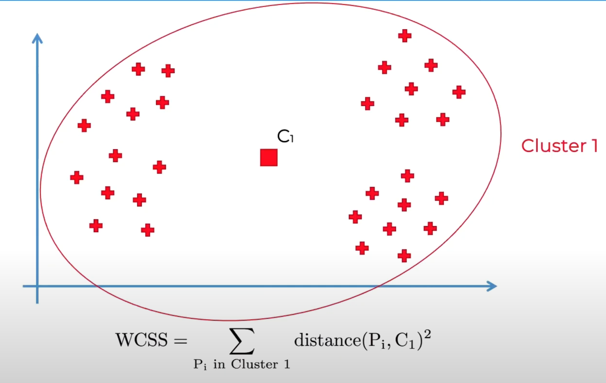

# Similarity Metrics

## Calculate the Euclidean distance, cosine similarity and Manhattan distance between "digital" and "information" using values from the "data" and "computer" column.

|                 | pie | data | computer |
| :-------------: | :-: | :--: | :------: |
|   **cherry**    | 442 |  8   |    2     |
|   **digital**   |  5  | 1683 |   1670   |
| **information** |  5  | 3982 |   3325   |

## 1. Euclidean Distance Calculation

Calculate the Euclidean distance between **"digital"** and **"information"** using values from the **data** and **computer** columns.

### Formula

$$
d(v, w) = \sqrt{(x_2 - x_1)^2 + (y_2 - y_1)^2}
$$

#### Given Values:

- **Digital:** $(1683, 1670)$
- **Information:** $(3982, 3325)$

#### Calculation:

$$
d = \sqrt{(3982 - 1683)^2 + (3325 - 1670)^2}
$$

$$
d \approx 2832.74
$$

> ### The Euclidean distance is **2832.74**

---

### Including the "pie" Column

Now, considering the **pie** column, we modify the formula:

$$
d(v, w) = \sqrt{(x_2 - x_1)^2 + (y_2 - y_1)^2 + (z_2 - z_1)^2}
$$

Since both "digital" and "information" have the same **pie** value (5), the calculation remains:

$$
d = \sqrt{(3982 - 1683)^2 + (3325 - 1670)^2 + (5 - 5)^2}
$$

$$
d \approx 2832.74
$$

> ### The distance **2832.74**

## 2. Cosine Distance Calculation

We calculate the **cosine distance** between **"digital"** and **"information"** using values from the **pie**, **data**, and **computer** columns.

### Formula

The **cosine similarity** between two vectors **A** and **B** is given by:

$$
\cos(v,w) =  \frac{v \cdot w}{\|v\| \|w\|}
 = \frac{\sum_{i=1}^{N} v_i w_i}{\sqrt{\sum_{i=1}^{N} v_i^2} \times \sqrt{\sum_{i=1}^{N} w_i^2}}
$$

where:

- $v_i$ and $w_i$ are the components of vectors **v** and **w**.
- The numerator is the **dot product** of **v** and **w**.
- The denominator is the **product of the Euclidean norms** of **v** and **w**.

---

### Given Values:

- **Digital:** $A = (5, 1683, 1670)$
- **Information:** $B = (5, 3982, 3325)$

### Calculation:

#### Step 1: Compute the Dot Product

$$
{\sum_{i=1}^{N} v_i w_i} = (5 \times 5) + (1683 \times 3982) + (1670 \times 3325) = 13341556
$$

#### Step 2: Compute the Magnitudes

$$
\sqrt{\sum_{i=1}^{N} v_i^2} = \sqrt{(5^2) + (1683^2) + (1670^2)} \approx 2367.76
$$

$$
\sqrt{\sum_{i=1}^{N} w_i^2} = \sqrt{(5^2) + (3982^2) + (3325^2)} \approx 5188.19
$$

#### Step 3: Compute Cosine Similarity

$$
\cos(v,w) = \frac{13341556}{(2367.76 \times 5188.19)} \approx 0.9963
$$

---

### Answer

> ### The **cosine distance** between "digital" and "information" is **0.9963**.

 

## 3. Manhattan Distance Calculation

The **Manhattan distance** between two vectors **W** and **V** is given by:

$$
d_{\text{Manhattan}}(v,w) = \sum_{i=1}^{N} |v_i - w_i|
$$

where:

- $v_i$ and $w_i$ are the components of vectors **W** and **V**.

---

### Given Values:

- **Digital:** $A = (5, 1683, 1670)$
- **Information:** $B = (5, 3982, 3325)$

#### Calculation:

$$
d_{\text{Manhattan}}(v, w) = |5 - 5| + |1683 - 3982| + |1670 - 3325|
$$

$$
= 0 + 2299 + 1655 = 3954
$$

---

### Answer:

> ### The **Manhattan distance** between "digital" and "information" is **3954**.

 

## Jaccard Similarity

The **Jaccard similarity** between two sets **V** and **W** is given by:

$$
Jaccard(v, w) = \frac{|v \cap w|}{|v \cup w|}
$$

where:

- $ |v \cap w| $ is the **size of the intersection** (common elements).
- $ |v \cup w| $ is the **size of the union** (all unique elements).

---

### Given Sets:

- $v$ = {‘Lion’, ‘Tiger’, ‘Cheetah’, ‘Leopard’, ‘Rhino’}
- $w$ = {‘Lion’, ‘Monkey’, ‘Cheetah’, ‘Cat’, ‘Dog’}

---

### Calculation:

#### **Step 1: Compute the Intersection**

$$
v \cap w = \{\text{Lion}, \text{Cheetah} \}
$$

$$
|v \cap w| = 2
$$

#### **Step 2: Compute the Union**

$$
v \cup w = \{\text{Lion}, \text{Tiger}, \text{Cheetah}, \text{Leopard}, \text{Rhino}, \text{Monkey}, \text{Cat}, \text{Dog} \}
$$

$$
|v \cup w| = 8
$$

#### **Step 3: Compute Jaccard Similarity**

$$
Jaccard(v, w) = \frac{2}{8} = 0.25
$$

---

### **Answer:**

The **Jaccard similarity** between **V** and **W** is **0.25** (or **25% similarity**).

---

## When to use each?

| **Measure**            | **Best For**                     | **Limitation**                                        |
| :--------------------- | -------------------------------- | ----------------------------------------------------- |
| **Euclidean Distance** | Low-dimensional numeric data     | Affected by scale, not good for high-dimensional data |
| **Manhattan Distance** | Grid-based movement              | Ignores diagonal movement                             |
| **Cosine Similarity**  | Text data, High-dimensional data | Ignores magnitude differences                         |
| **Jaccard Similarity** | Categorical/set data             | Doesn't consider feature weights                      |

 

---

 

# Clustering Techniques for Text

**Process of comparing two pieces of text and find how similar they are**

#### Raw data:

  

#### One cluster:

  

#### Two clusters:

  

#### Three clusters:

  

### K-Means Clustering Steps:

1. **Select K Cluster Centers at Random**

   - Choose **K** initial centroids randomly from the dataset.
   - OR choosing the number of clusters (k) using the **Elbow Method**.

2. **Assign Every Data Point to the Nearest Cluster Center**
   - Compute the **distance** lets use **Euclidean Distance** of each data point from the centroids.

  

 <i>Note: elements number 3,5 and 8 are selected as centoreds below</i>

- Assign each point to the **nearest centroid**, forming clusters.

3. **Compute the Actual Center for Each Cluster**
   - Recalculate the **centroid** of each cluster by taking the **mean** of all data points in that cluster.

  To be ⇓  

4. **Reassign All Data Points to the Nearest (New) Cluster Center**
   - Update the cluster memberships based on the **new centroids**.

  To be ⇓  

5. **Repeat Steps 3 and 4 Until Convergence**
   - Continue updating centroids and reassigning points until:
     - The **cluster centers stop changing**, or
     - A **maximum number of iterations** is reached.

### Elbow Methode

**The Elbow Method is used to determine the optimal number of clusters (K) in K-Means Clustering.**

## Scenario:

#### Apply K-Means Clustering for Netflix Movie Recommendation

1. **Data Collection**

   - Gather user data including **watch history, genres watched, average ratings, and watch time**.

2. **Choose the Number of Clusters (K)**

   - Use the **Elbow Method** to determine the optimal number of clusters.

3. **Initialize Centroids**

   - Randomly select **K** initial centroids from the dataset.

4. **Assign Users to the Nearest Cluster**

   - Compute the **Euclidean Distance** between each user and the centroids.
   - Assign each user to the closest cluster.

5. **Update Cluster Centroids**

   - Compute the **new centroid** by averaging the features of users in each cluster.

6. **Repeat Steps 4 & 5 Until Convergence**

   - Reassign users to clusters and update centroids until they **no longer change**.

7. **Interpret Clusters & Make Recommendations**
   - Identify user segments (e.g., **Action lovers, Comedy fans, Binge-watchers**).
   - Recommend movies based on cluster preferences.
