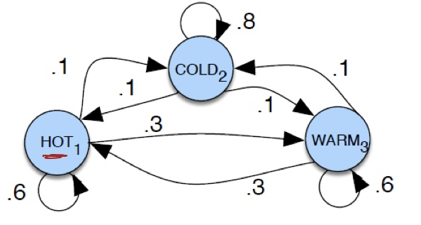
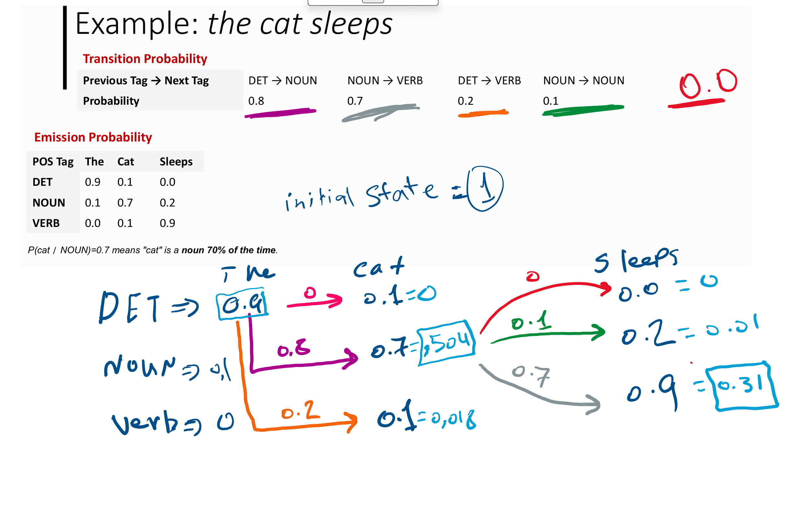

## Markov Chain

### **Step 1: Extract the Transition Matrix**

From the diagram, the **states** are:

- **HOT**
- **COLD**
- **WARM**

The **transition probabilities** are:

$$
Hot =>
\begin{bmatrix}
HOT  (0.6) & COLD (0.1) & WARM(0.3) \\
\end{bmatrix}
$$

$$
COLD =>
\begin{bmatrix}
HOT  (0.1) & COLD (0.8) & WARM(0.1) \\
\end{bmatrix}
$$

$$
WARM =>
\begin{bmatrix}
HOT  (0.3) & COLD (0.1) & WARM(0.6) \\
\end{bmatrix}
$$

$$
P =
\begin{bmatrix}
0.6 & 0.1 & 0.3 \\
0.1 & 0.8 & 0.1 \\
0.3 & 0.1 & 0.6
\end{bmatrix}
$$

---

### **Step 2: Compute the Probabilities for the Given Sequences**

We compute the **probability of each sequence occurring** by multiplying the transition probabilities.

#### **1st Sequence: "HOT → HOT → HOT → COLD"**

$$
P(\text{HOT} \to \text{HOT}) = 0.6
$$

$$
P(\text{HOT} \to \text{HOT}) = 0.6
$$

$$
P(\text{HOT} \to \text{COLD}) = 0.1
$$

Total probability:

$$
P(\text{HOT}, \text{HOT}, \text{HOT}, \text{COLD}) = 0.6 \times 0.6 \times 0.1 = 0.036
$$

---

#### **2nd Sequence: "COLD → HOT → COLD → HOT"**

$$
P(\text{COLD} \to \text{HOT}) = 0.1
$$

$$
P(\text{HOT} \to \text{COLD}) = 0.1
$$

$$
P(\text{COLD} \to \text{HOT}) = 0.1
$$

Total probability:

$$
P(\text{COLD}, \text{HOT}, \text{COLD}, \text{HOT}) = 0.1 \times 0.1 \times 0.1 = 0.001
$$

---

### **Final Answer**

- **$P(\text{HOT} \to \text{HOT} \to \text{HOT} \to \text{COLD}) = 0.036$**
- **$P(\text{COLD} \to \text{HOT} \to \text{COLD} \to \text{HOT}) = 0.001$**

 

---

## Decoding HMM

